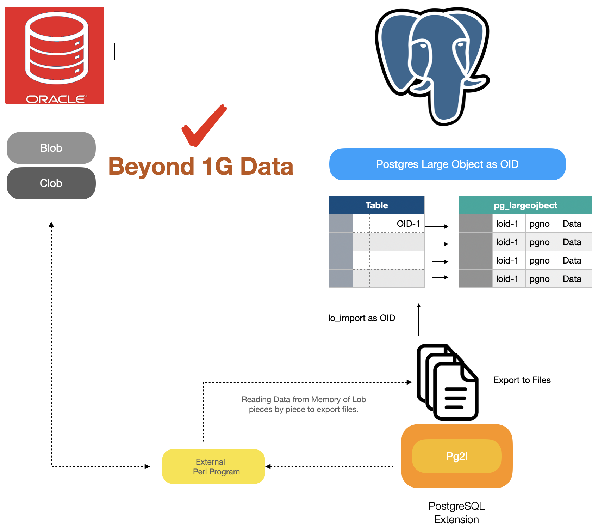

## What is pg2l?

pg2 large object loader (aka.pg2l) is a kind of extension to help migrate beyond 1GB CLOB/BLOB Data from Oracle.

When migrating data of clob/blob column type from Oracle to PostgreSQL, It corresponds to bytea not oid in most of migration tools.

but bytea has a limitation maximum of 1GB of data stored.

In order to help this issue I implemented this extension.

In most of these cases, we must do it by manually migrating data from Oracle to Postgresql for this cases.

This extension matched the oid column type as Oracle's clob/blob and imported data from files after connecting to Oracle and exporting to files.

This extension used an external Perl application which I implemented and this program is called by internal function.

See below figure.





## Installation

First, This Extension has to connect to the Oracle database to export large objects as files.

so It needs to Oracle Instant client on the PostgreSQL side.

Second, this extension calls external Perl applications doing import to the target table which gets from the source database.

Therefore It needs an environment for running Perl programs as well.


Contents

1. Install Oracle Instant Client & Configuration

2. Perl environment and Install & Configuration if it needs to. 

3. Create Extension

4. Configuration.

5. pg2l's function

6. Examples


* Prerequisite

```bash
$yum update
```


1. Install Oracle Instant Client & Configuration

   Oracle Instant Client Should be installed where the PostgreSQL server is present because of pg2l extension will use an Oracle library. If you have already installed Oracle Client you are able to skip this steps.

   

   1. First of all, We need to install Oracle Instant Client to connect to Oracle databases.
      See [this](https://www.oracle.com/kr/database/technologies/instant-client/linux-x86-64-downloads.html) site to install it.

      ```bash
      yum install -y oracle-instantclient-basic-21.11.0.0.0-1.el8.x86_64.rpm
      ```

      

      ***Important*** 

      pg2l used perl script along with oracle DBD. This moudle refer to the oci.h header files.

      thus we have to down load file (oracle-instantclient-devel-xxx.xxx.rpm) and install it for this. 

      

   2. Install oracle-instantclient-devel-xxx.xxx.rpm

      ```bash
      $yum install -y oracle-instantclient-devel-21.11.0.0.0-1.el8.x86_64.rpm
      ```

      

      * After installing the Oracle Instant Client, You must set the environment variable regarding the oracle setting like figure below in your profile on root account.

      ```bash
      export ORACLE_HOME=/usr/lib/oracle/21/client64/
      export TNS_ADMIN=/usr/lib/oracle/21/client64/bin
      export PATH=${PATH}:$HOME/bin:$ORACLE_HOME/bin
      export LD_LIBRARY_PATH=${LD_LIBRARY_PATH}:$ORACLE_HOME/lib
      ```

      

2. Perl environment. (Run as PostgreSQL Instance Owner like postgresql) [run as root]

   1. perl version need to above 5 to run pg2l.
      if you don't have perl version 5 you need to install in

      ```bash
      # run perl -v
      $ perl -v
      
      This is perl 5, version 32, subversion 1 (v5.32.1) built for x86_64-linux-thread-multi
      (with 52 registered patches, see perl -V for more detail)
      ......
      ```

   2. Install the cpan

      capn command is manage package of perl.  pg2l need to some perl module like to connect to oracle. 

      so, It need to install if it did not installed on your system.  [run as root]

      ```bash
      $yum install cpan
      ```

   3. Install required pm to run pg2l.  Before Create Extension run cpan command as figure below. [run as root]

      ```bash
      $cpan Time::HiRes
      $cpan DBI.pm
      $cpan DBD::Oracle
      ```


3. Create Extension

   If you encounted error like 'make command not found' you need to install the make utility as figure below.  [run as root user]

   ```bash
   yum install -y make
   ```

   

   1. Setting environment 

      To Create PostgreSQL extension we need to pg_config.   

      So Add path which bin directory of postgresql in root account profiles as figue below. 

      And pg2l extension will be running external perl script. Basically It's located in owner accound of postgresql.

      So Define the home directory of owner account of postgresql in root account profile as figure below.
   
      (When 'make install' command to install the extension,  perl script file will be move to under the owner account of postgresql)
   
      ```bash
      export PATH=${PATH}:/usr/edb/as15/bin # To use pg_config when install pg2l extension
      export PG_HOME=/var/lib/edb           # defined basic location of perl script
      ```

      
   
   2. Download extension 
   
      After donwnload pg2l extension from github copy to the contrib directory as below figure. [run as root user]

      ```bash
      cp pg2l-master.zip /usr/edb/as15/share/contrib
      cd /usr/edb/as15/share/contrib
      unzip pg2l-master.zip
      ```
   
      
   
   3. install extension 
   
      run make install  [run as root user]
   
      ```bash
      cd pg2l-master
      make install
      ```
   
      If you have setting environment variable properly You may see the below messages after 'make install command' 
   
      ```bash
      $make install
      /usr/bin/mkdir -p '/usr/edb/as15/share/extension'
      /usr/bin/mkdir -p '/usr/edb/as15/share/extension'
      mkdir -p /var/lib/edb/pg2l
      cp ./exp_lob_from_ora.pl /var/lib/edb/pg2l
      chown -R enterprisedb:enterprisedb /var/lib/edb/pg2l
      /usr/bin/install -c -m 644 .//pg2l.control '/usr/edb/as15/share/extension/'
      /usr/bin/install -c -m 644 .//pg2l--1.0.sql  '/usr/edb/as15/share/extension/
      ```
   
      
   
   4. Create Extension 
   
      Switch user to the owner of Postgres like enterprisedb account to create extension like below figure.
      pg2l extension written perl script so we need to plperu extension first then create extension for pg2l 
   
      [run as owner of postgresql account]
   
      ```bash
      $ su - enterprisedb
      $ psql -d edb -c "CREATE EXTENSION plperlu"
      CREATE EXTENSION
      $ psql -d edb -c "CREATE EXTENSION pg2l"
      
      ```

4. Configuration

​	To connect to a Oracle database We have to configuration for the target database (oracle) information as lists below.

* Host IP

* Service Port

* SID

* ID

* PWD

* Target directory to export files

  [examples]
  After refered example Please do proper your environment. 

  Set the location of perl in your system
  
  ```bash
  psql -d edb -c "select pg2l_set_conf('PG2L.LOCATION_PERL','/usr/bin/perl');" 
  ```
  
  

  Set the location of external pg2l application

  ```bash
  psql -d edb -c "select pg2l_set_conf('PG2L.LOCATION_PRG','/var/lib/edb/pg2l/exp_lob_from_ora.pl');"
  ```
  
  
  
  Set the Host IP (Name) of Oracle
  
  ```bash
  psql -d edb -c "select pg2l_set_conf('PG2L.ORA_HOST','172.16.250.130');"
  ```
  
  
  
  Set the Port of Oracle
  
  ```bash
  psql -d edb -c "select pg2l_set_conf('PG2L.ORA_PORT','1521');" 
  ```
  
  
  
  Set the SID of Oracle
  
  ```bash
  psql -d edb -c "select pg2l_set_conf('PG2L.ORA_SID','ORCLCDB');"
  ```
  
  
  
  Set the ID of Oracle
  
  ```bash
  psql -d edb -c "select pg2l_set_conf('PG2L.ORA_ID','system');" 
  ```
  
  
  
  Set the Password of Oracle
  
  ```bash
  psql -d edb -c "select pg2l_set_conf('PG2L.ORA_ID','manager');"
  ```
  
  
  
  Set the Diretory Path to export files
  
  ```bash
  psql -d edb -c "select pg2l_set_conf('PG2L.TARGET_PATH','/var/lib/edb/pg2l');"
  ```
  


5. pg2l's function

------

Function : **pg2l_set_conf(VARCHAR default '',VARCHAR default '')**

Description :  To connect to Oracle which wants to migrate of B(C)lob It should be set this before using pg2l extension.
When setting the configuration for this You are able to use this function. pg2l tries to connect to the target oracle using this information.

Paramenter : 

​	1st : key for configraion of pg2l

​	2nd : values for configraion of pg2l	

* Before using pg2l extension **It must be set configuration as below**.

  If not set the proper values for each configuration It will not work.

  See list of table and Examples.

| Key                | Values (Default Values)                      |
| ------------------ | -------------------------------------------- |
| PG2L.LOCATION_PERL | Location of Perl                             |
| PG2L.LOCATION_PRG  | Location External pg2l application           |
| PG2L.ORA_HOST      | The Source Host IP(or name) of Oracle Server |
| PG2L.ORA_PORT      | The Source Port of Oracle Server             |
| PG2L.ORA_SID       | The SID of Oracle Server                     |
| PG2L.ORA_ID        | The ID of Oracle Server                      |
| PG2L.ORA_PWD       | The Password of Oracle Server                |
| PG2L.TARGET_PATH   | The path of exports file by pg2l             |


[Examples] 

Set the location of perl in your system

```bash
psql -d edb -c "select pg2l_set_conf('PG2L.LOCATION_PERL','/usr/bin/perl');" 
```


Set the location of external pg2l application

```bash
psql -d edb -c "select pg2l_set_conf('PG2L.LOCATION_PRG','/var/lib/edb/pg2l');"
```


Set the Host IP (Name) of Oracle

```bash
psql -d edb -c "select pg2l_set_conf('PG2L.ORA_HOST','172.16.250.137');"
```


Set the Port of Oracle

```bash
psql -d edb -c "select pg2l_set_conf('PG2L.ORA_PORT','1521');" 
```


Set the SID of Oracle

```bash
psql -d edb -c "select pg2l_set_conf('PG2L.ORA_SID','ORCLCDB');"
```


Set the ID of Oracle

```bash
psql -d edb -c "select pg2l_set_conf('PG2L.ORA_ID','system');" 
```


Set the Password of Oracle

```bash
psql -d edb -c "select pg2l_set_conf('PG2L.ORA_PWD','manager');"
```


Set the Diretory Path to export files

```bash
psql -d edb -c "select pg2l_set_conf('PG2L.TARGET_PATH','/var/lib/edb/pg2l');" 
```


Function : **pg2l_get_conf(VARCHAR default '',VARCHAR default '') **

Paramenter : 

​	1st : key for configraion of pg2l

Description : To check the configuration of pg2l which was set by the user you are able to find out using this function.


[Examples] 

This smaple is setting the location of perl in your systems.

```bash
$psql -d edb -c "select pg2l_get_conf('PG2L.ORA_PORT')"
 pg2l_get_conf
---------------
 1521
(1 row)
```

------

Function : **pg2l_ora_status()**

Paramenter : none

Description : To find out the status of Oracle's connection which is set by a user you are able to use these functions. If is returned "connection not ok" you have to fix it (or reconfiguration) after investigating the setting of pg2l.


[Examples] 

```bash
$ psql -d edb -c "select * from  pg2l_ora_status()"
 pg2l_ora_status
-----------------
 connection ok
(1 row)
```


The below sample has set the wrong port of Oracle. 
After checking the error code of Oracle You have to set the proper values using select pg2l_set_conf functions or You must check for the status of Oracle before using the pg2l extension.

```bash
$ psql -d edb -c "select pg2l_set_conf('PG2L.ORA_PORT','9000');"
 pg2l_set_conf
---------------
 9000
(1 row)

$ psql -d edb -c "select * from  pg2l_ora_status()"
                        pg2l_ora_status
----------------------------------------------------------------
 connection fail                                               +
 [12541]ORA-12541: TNS:no listener (DBD ERROR: OCIServerAttach)
(1 row)
```

------

Function : **pg2l_get_status()**

Paramenter : none

Description : We are able to find out the setting value of all of the configurations for pg2l regarding the Oracle Environments including the status of oracle connection.

[Examples] 

```bash
$ psql -d edb -c "select * from  pg2l_get_status()"
 no |      pg2lcfg       |                 value
----+--------------------+---------------------------------------
  1 | PG2L.LOCATION_PERL | /usr/bin/perl
  2 | PG2L.LOCATION_PRG  | /var/lib/edb/pg2l/exp_lob_from_ora.pl
  3 | PG2L.ORA_HOST      | 172.16.250.137
  4 | PG2L.ORA_PORT      | 1521
  5 | PG2L.ORA_SID       | ORCLCDB
  6 | PG2L.ORA_ID        | system
  7 | PG2L.ORA_PWD       | manager
  8 | PG2L.TARGET_PATH   | /var/lib/edb/pg2l/pg2l_exp
  9 | Status Of Oracle   | connection ok
(9 rows)
```

------

Function : **pg2l_get_filename(VARCHAR default '')**

Paramenter : 

​	*1st* : Select statement of oracle which you want to export to files of oracle.

Description : Export files of b(clob) from the Oracle server to the target path which is set according to the configuration.

and the convention of file name is   


​	`[Schema].[Tables Name].[Name of Primary Column].[Value of Primary Column].[epoch timestamp][sequence]`


[Examples] 

```
$ psql -d edb -c "select pg2l_get_filename('select lob_data from ps.ptable where id = 1')"
               pg2l_get_filename
-----------------------------------------------
 /var/lib/edb/pg2l/ps.ptable.id_1_1694510962_1
(1 row)
```

If running success of pg2l_get_filename You are able to find it through return values which location of files.


Limition for 1st parameter

 * A selected column should have only one column which has the type clob (or blob)	
 * group by / order by and joining between (among) the tables does not support it. 
   if you want to complex join with multiple tables you are better using the views object to include what you want to join.


Caution

* If you have multiple data exports using SQL statements You have to check your free disk before running this extension.

------

Function : pg2l_get_oid(VARCHAR default '',INTEGER default 1) 

Paramenter :
	1st : Select statement of oracle which you want to export to files of oracle.  

​	2nd : Deletion flag for exported files. 

​		 if set the 1, after getting OID exported files will be deleted automatically else exported files will not deleted. (default is 1)

Description : Get OID for large object .


[Examples] 

```
[enterprisedb@srv1 ~]$ psql -d edb -c "select  pg2l_get_oid('select lob_data from ps.ptable where id = 1')"
 pg2l_get_oid
--------------
        42014
(1 row)
```

After running the pg2l_get_oid function If it has success you may get the oid from SQL Statements as return values.

and You can verify data via below SQL Statements below as well.

```
$ psql -d edb -c "select  * from pg_largeobject where loid = 42014"
```


Using this way allows large objects to provide information to tables in a variety of ways.
See examples sections.

------

Function : pg2l_get_lob_length(VARCHAR default '',INTEGER default 1) 

Paramenter : Returns the length of the lob data You are interested in from Oracle through SQL.

Description : Getting lob value length. (***Will be implemented***)

------

Function : pg2l_get_lob_length(VARCHAR default '',INTEGER default 1) 

Paramenter : none

Description : Getting status of pg2l regarding the Oracle Environments.(***Will be implemented***)

------

Function : pg2l_get_oid_from_script(VARCHAR default '') 

Paramenter : none

Description : Getting status of pg2l regarding the Oracle Environments.(***Will be implemented***)

------

Function :  pg2l_get_filename_from_script(VARCHAR default '') 

Paramenter : none

Description : Getting status of pg2l regarding the Oracle Environments.(***Will be implemented***)


